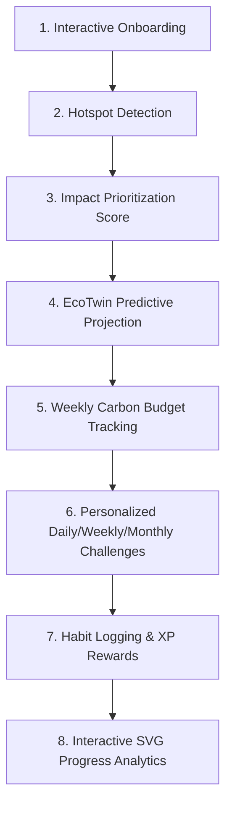
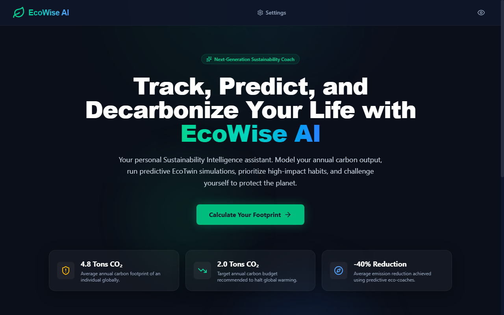
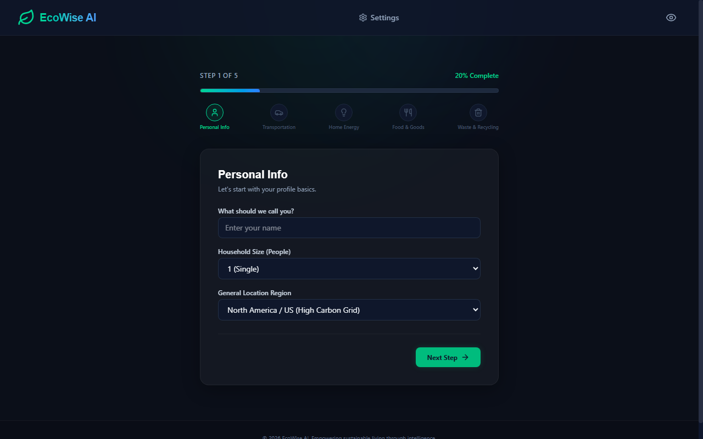
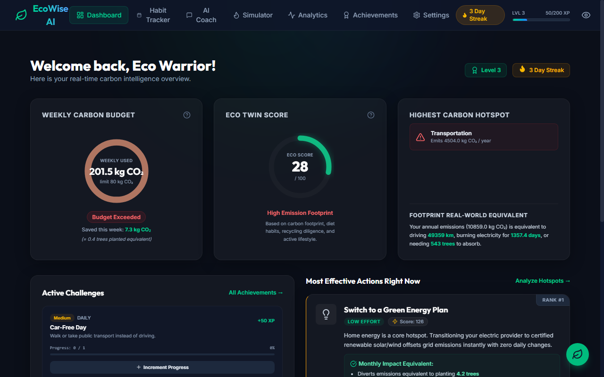
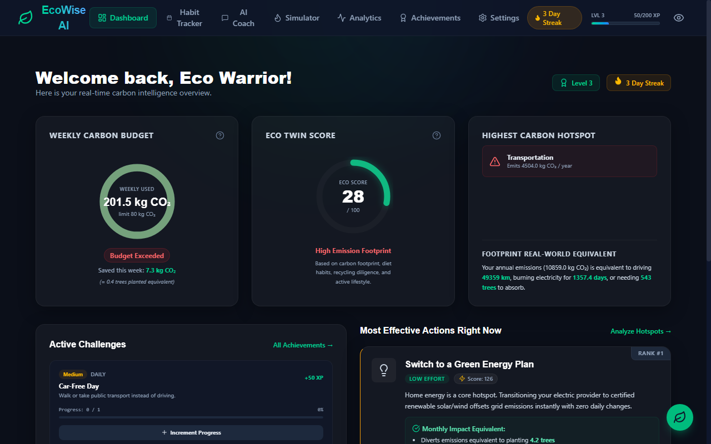
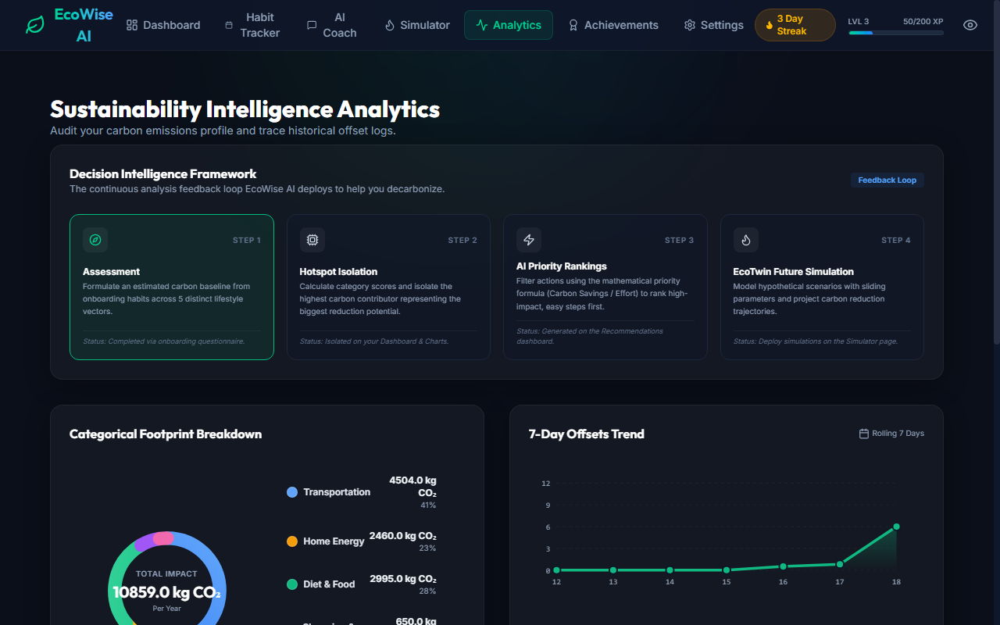
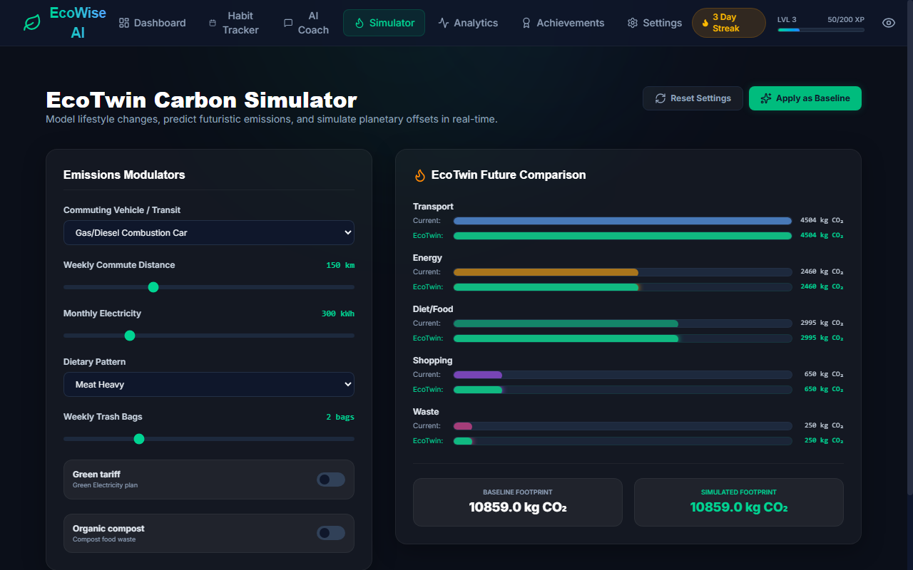
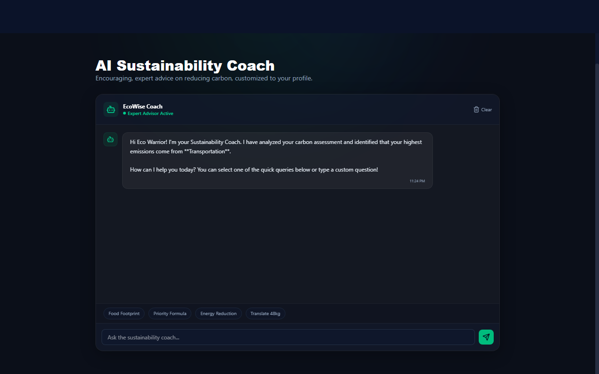
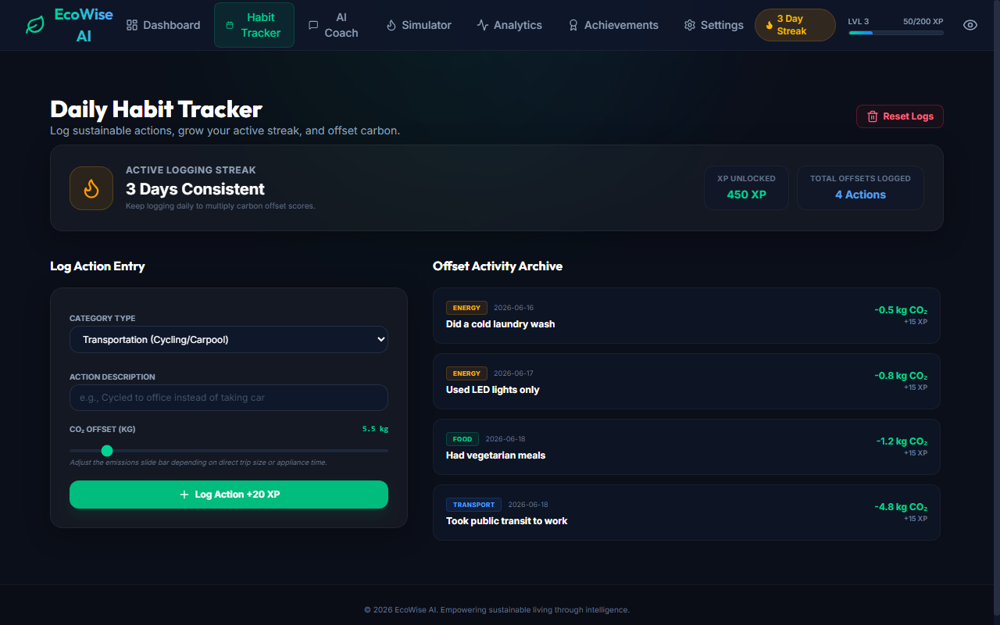
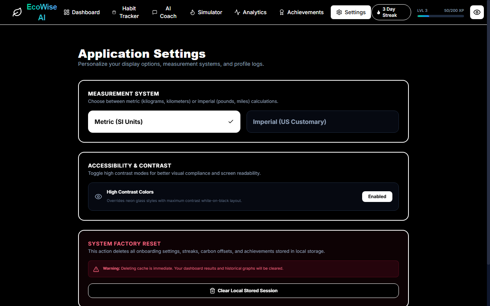

# EcoWise AI

> **Tagline:** An intelligent sustainability coach that helps users understand, track, and reduce their carbon footprint through personalized insights, future projections, and actionable recommendations.

---

## 🔗 Live Demo
Visit the live client-side application here: **[https://yuvrajgora.github.io/EcoWise-AI/](https://yuvrajgora.github.io/EcoWise-AI/)**

---

## 💡 Problem Statement

Many people want to live sustainably but struggle to understand:
* **Their carbon footprint**: Raw values (like "12 metric tons of CO₂/year") are abstract and difficult to conceptualize.
* **Highest-impact behaviors**: Knowing which behaviors contribute most to emissions (e.g., transit vs. heating vs. diet) is not intuitive.
* **Effective actions**: Choosing actionable steps that produce the maximum emissions reduction with the realistic effort budget is challenging.

Most existing solutions provide static calculators that output standard values but fail to guide long-term, gamified behavioral change.

---

## 🌟 Solution Overview

**EcoWise AI** is a premium client-side sustainability intelligence platform that:
1. **Calculates Emissions**: Performs a localized onboarding questionnaire covering transportation, electricity, food, clothing, and waste habits.
2. **Detects Hotspots**: Dynamically parses profile data to find the highest-emitting categories.
3. **Prioritizes Actions**: Ranks recommendations dynamically using an algorithm that balances carbon savings against effort levels.
4. **Predicts Future Outcomes**: Utilizes the **EcoTwin** predictive modeling engine to visualize current vs. recommended futures.
5. **Tracks Progress**: Gamifies daily carbon logging, tracking streaks, levels, XP rewards, and unlocked badges.
6. **Generates Personalized Challenges**: Dynamically serves custom sustainability challenges targeted at the user's high-emissions areas.

---

## 🛠️ Key Innovations

### 1. Sustainability Intelligence Engine (`src/utils/sustainabilityIntelligence.ts`)
Analyzes user lifestyle indicators to calculate annual emissions. Automatically detects which of the five categories (Transport, Energy, Food, Shopping, Waste) represents the user's primary environmental hotspot.

### 2. Impact Prioritization Engine (`src/utils/aiPriorityEngine.ts`)
Instead of static checklists, actions are sorted dynamically using a Priority Score:
$$\text{Priority Score} = \frac{\text{Monthly CO₂ Savings (kg)} \times 1.8}{\text{Effort Level (1-3)} \times 1.2}$$
This delivers the **"Most Effective Actions Right Now"** ordered by maximum planetary benefit per unit of user effort.

### 3. EcoTwin Prediction Engine (`src/utils/ecoTwinEngine.ts`)
Generates a predictive "EcoTwin" model representing the user's recommended future self. It showcases a direct comparison of current annual emissions vs. target emissions, percentage reductions, and a custom **Sustainability Score** (scaled 10 to 100).

### 4. Carbon Budget System
Tracks weekly carbon usage against a target sustainability budget limit (80 kg CO₂). The interface displays a dynamic gauge showing remaining weekly capacity and warning signs if the budget is approaching its limit.

### 5. Personalized Challenge Generator
Creates custom daily, weekly, and monthly sustainability tasks tailored to the user's highest emissions hotspot. Completing tasks awards XP and updates the carbon budget in real time.

### 6. Environmental Impact Translator (`src/utils/impactTranslator.ts`)
Translates abstract carbon weights into vivid real-world equivalents:
* **$1 \text{ Tree Planted} \approx 20 \text{ kg CO₂ Saved}$**
* **$1 \text{ km Less Driving} \approx 0.22 \text{ kg CO₂ Saved}$**
* **$1 \text{ Day of Household Electricity} \approx 8 \text{ kg CO₂ Saved}$**

---

## 🧠 Decision Intelligence Framework



---

## 📱 Features

- **Carbon Assessment**: Fast, intuitive profile setup wizard covering 5 primary emission sources.
- **Habit Tracker**: Logs green habits, tracks streak counts, logs custom offsets, and saves stats.
- **Sustainability Coach**: Interactive messaging console with AI coach that delivers carbon diagnostics.
- **Carbon Simulator**: Interactive sliders allowing users to simulate how behavior modifications alter their future projections.
- **EcoTwin Projections**: Visualization dashboard of the user's carbon duplicate profile.
- **Carbon Budget**: Dynamic gauge tracking monthly and weekly carbon allowance.
- **Challenges Panel**: Custom timeframed goals (Daily/Weekly/Monthly) with XP.
- **Badges & XP**: Gamified rewards dashboard to encourage positive behavior modification.
- **Analytics Dashboard**: Custom responsive SVG analytics charts including category breakdown donuts, historical projections, and decision flow maps.
- **Accessibility Settings**: Support for high-contrast mode, unit conversion (Metric/Imperial), and keyboard navigation.

---

## 📸 Screenshots

### 1. Landing Page
**
*The welcoming homepage detailing features, tagline, and introductory copy.*

### 2. Onboarding
**
*Interactive step-by-step wizard collecting user lifestyle metrics.*

### 3. Dashboard
**
*The main hub displaying Carbon Budget, Sustainability Score, and quick actions.*

### 4. Sustainability Score
**
*The gauge showing target annual carbon budgets and current footprint health.*

### 5. EcoTwin Projections
**
*Comparison dashboard displaying current lifestyle projections vs. the recommended future self.*

### 6. Carbon Simulator
**
*Interactive sliders allowing users to model emission reductions on the fly.*

### 7. Sustainability Coach
**
*Interactive chat console showing personalized responses and hotspot reports.*

### 8. Personalized Challenges
**
*Daily, weekly, and monthly challenges tailored to user hotspots.*

### 9. Analytics Dashboard
**
*Interactive SVG breakdown, line trends, and decision intelligence graph.*

### 10. Settings & Accessibility
**
*Preferences manager for high-contrast mode, metric/imperial units, and profile resets.*

---

## 🏗️ Architecture

* **Frontend Framework**: React 19 (Functional components, custom Hooks)
* **Build Tooling**: Vite 8 & TypeScript 5
* **Styling**: Tailwind CSS v4 (Glassmorphism design tokens, custom responsive transitions)
* **State Management**: React Context API (`AppContext.tsx`)
* **Persistence**: Client-side `localStorage` API
* **Graphics**: Custom, responsive inline SVG components (no heavy external chart libraries to keep repo size minimal)

---

## 📂 Folder Structure

```
EcoWise-AI/
├── public/
│   ├── screenshots/       # Application flow screenshots
│   │   └── README.md      # Screenshot capturing guide
│   ├── favicon.svg        # App browser icon
│   └── icons.svg          # Preloaded SVG symbol mappings
│
├── src/
│   ├── assets/            # Clean assets directory (empty to minimize size)
│   ├── components/        # Reusable UI elements (Navbar, ActionCard, VisualCharts)
│   ├── context/           # AppState and Context Provider (AppContext)
│   ├── pages/             # Layout pages (Landing, Onboarding, Dashboard, etc.)
│   ├── types/             # Centralized TypeScript interface definitions (index.ts)
│   ├── utils/             # Engine logic (intelligence, prioritization, twin, translator)
│   ├── App.tsx            # Main router and shell layout
│   └── main.tsx           # React bootstrap entry point
│
├── README.md              # Project overview and submission documentation
├── CONTRIBUTING.md        # Contributions guidelines
├── LICENSE                # MIT License
├── package.json           # Node configuration and script definitions
├── tsconfig.json          # Root TypeScript configuration
├── vite.config.ts         # Vite project settings
└── .gitignore             # Ignored paths list
```

---

## 🚀 Installation & Setup

1. **Clone the Repository**:
   ```bash
   git clone https://github.com/YuvrajGora/EcoWise-AI.git
   cd EcoWise-AI
   ```

2. **Install Dependencies**:
   ```bash
   npm install
   ```

3. **Start Development Server**:
   ```bash
   npm run dev
   ```
   *The application will be served at `http://localhost:5173/`.*

4. **Build for Production**:
   ```bash
   npm run build
   ```
   *Static assets will be compiled into the `dist/` directory with type checking and minification.*

---

## 🧪 Automated Testing

EcoWise AI implements a comprehensive testing suite using **Vitest** and **React Testing Library** to validate both core logic engines and interactive UI components.

### Running Tests
To run the automated tests locally:
```bash
npm run test
```

### Coverage Generation
To execute the tests and generate a detailed coverage report:
```bash
npm run coverage
```

### Tested Modules
* **Core Logic Engines**:
  * `sustainabilityIntelligence.ts`: Verifies carbon calculations by category (Transport, Energy, Food, Shopping, Waste) and hotspot detection math.
  * `aiPriorityEngine.ts`: Validates dynamic priority rank ordering based on the savings-to-effort formula.
  * `ecoTwinEngine.ts`: Tests the recommended projection math and sustainability score limits.
  * `impactTranslator.ts`: Validates the accuracy of translating kilograms of CO₂ into trees, driving kilometers, and household electricity equivalents.
* **UI Components**:
  * `Dashboard.tsx`: Tests rendering of metrics, hotspots, active challenges, and floating quick log interactions.
  * `CarbonSimulator.tsx`: Validates range slider input adjustments, simulation calculations, and resetting to baseline.

---

## ♿ Accessibility

* **Keyboard Navigation**: Focus indicators and keypress triggers are fully supported on all interactive buttons, cards, and input fields.
* **High Contrast Mode**: Custom high-contrast overrides to optimize readability for visually impaired users.
* **Reduced Motion Support**: Animations are disabled/restrained when preferred by OS settings or when utilizing high-contrast mode.
* **Screen Reader Friendly**: Standard semantic tags (`<header>`, `<main>`, `<section>`, `<nav>`) and explicit `aria-label` tags on controls.
* **Responsive Design**: Fluid flexbox/grid layout system to provide an optimal layout across screen heights and device profiles.

---

## 🔮 Future Improvements

1. **Real-world Carbon APIs**: Connect transport and energy calculations with real-time state grid carbon intensity APIs (e.g., WattTime).
2. **AI Language Processing**: Integrate Gemini API or a local LLM for conversational coaching based on logged user habits.
3. **Community leaderboards**: Set up social challenges, family carbon groups, and peer comparison rankings.
4. **Carbon Offset Integrations**: Allow users to purchase verified gold standard carbon offsets directly through credit integrations.

---

## 📄 License
Distributed under the MIT License. See [LICENSE](LICENSE) for more details.

---

## 🖥️ GitHub Deployment

Deploy the project using the following git commands:

```bash
# Initialize local repo
git init

# Stage files
git add .

# Commit modifications
git commit -m "Initial release: EcoWise AI"

# Set branch name to main
git branch -M main

# Connect repository
git remote add origin https://github.com/YuvrajGora/EcoWise-AI.git

# Push changes to github
git push -u origin main
```
